# mergeutility
## Description
Utility that provides Mail Merge functionality to Google Sheets and Docs

## Setup
To set up this utility for a mail merge document, you'll need to:
* Create the template document
* Create the merge data
* Add the utility script to the merge data sheet

Once those steps are done, you can execute the utility as many times as you need. To set up another mail merge document, repeat the above three steps.

### Create the template document
Open Google Drive

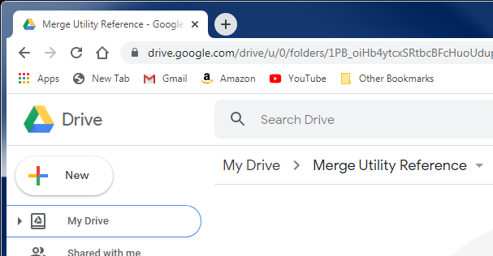

Create a new Google Doc (`+ New` :arrow_right: `Google Docs` :arrow_right: `Blank document`)

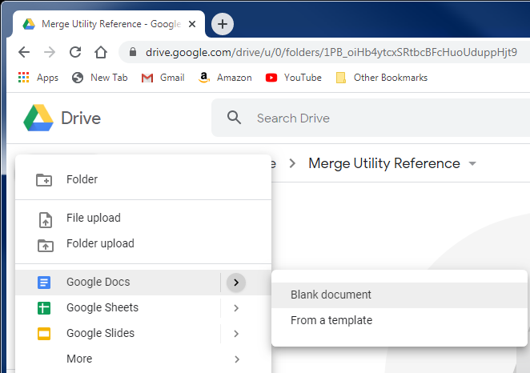

Enter the body of your template, using `<<` and `>>` to indicate variables that should be replaced as part of your mailmerge.

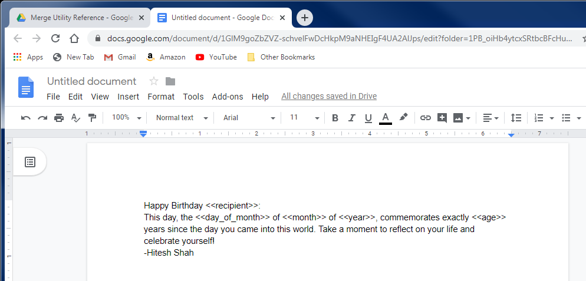

Give your document a name.

*NOTE*: The name must _not_ match any other document in any folder within your Drive. This is super-important, otherwise the merge utility won't work.

Also, make sure you remember the name because it'll be used later.

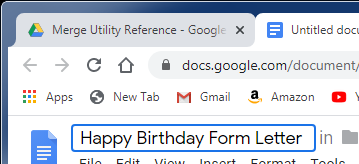

Done with the template

### Create the merge data
In Google Drive, create a new Google Sheet (`+ New` :arrow_right: `Google Sheets` :arrow_right: `Blank spreadsheet`)

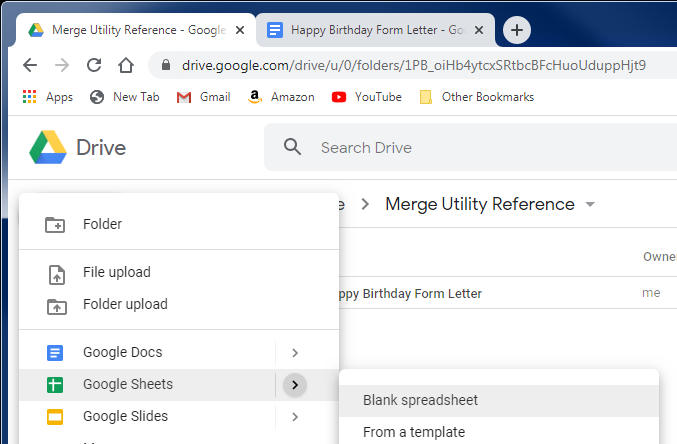

In the first row, enter each of the names of the variables you used in your template doc

For each copy of the letter you want to create, enter a new row in the sheet

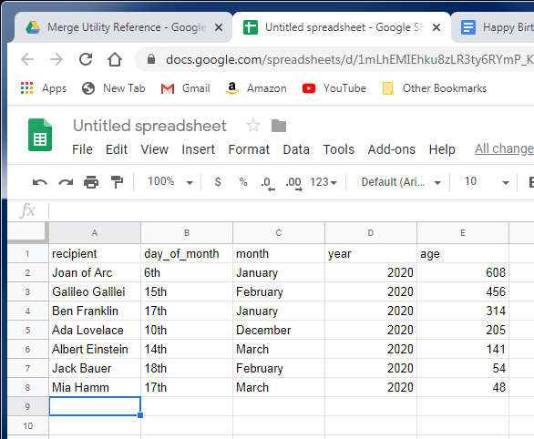

Give your spreadsheet a name. Any name will do.

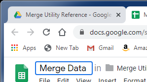

Name the tab to match the template document name exactly.

Done with the merge data

### Add the utility script to the merge data sheet
On the merge data spreadsheet, open the `Tools` menu and select the `Script Editor` option

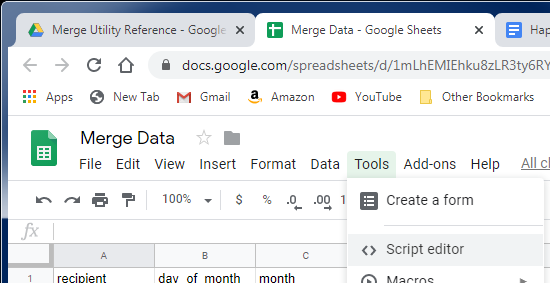

The script editor should open a file called `Code.gs` in a new tab (or window) of your browser, with an empty function called `myFunction`

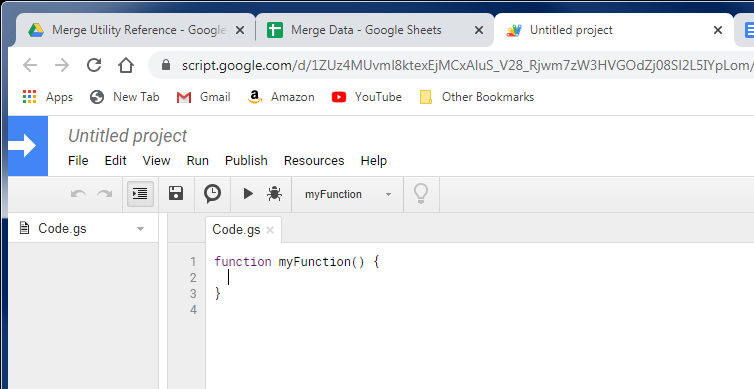

Replace all the contents of the script editor with contents of the utility script (all the code) from https://github.com/hvshah1974/mergeutility/blob/master/Code.gs, the `Code.gs` file in the root of this repository:

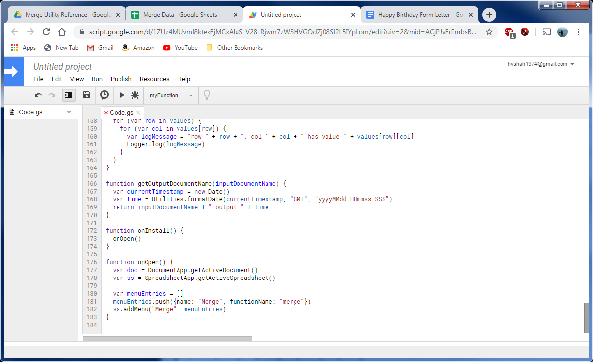

Select `File` :arrow_right: `Save` and enter a project name

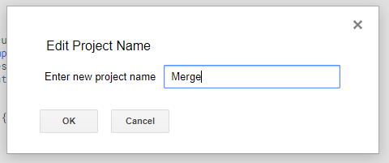

Done with setup

### To execute the script
The first time you want to execute the script after setting it up, you'll need to close all the documents you created (template doc and merge data spreadsheet).

Open the merge data spreadsheet. If this is the first time opening the spreadsheet after setting up the utility, it'll take some time to open. Once it's open, you should see a new menu option for `Merge`, after the `Help` menu

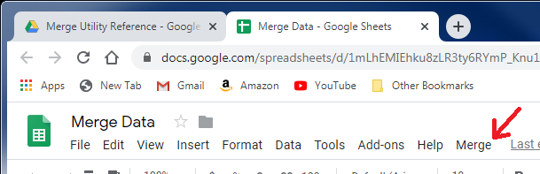

Opening the Merge menu should give you one option called `Merge`

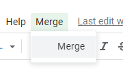

Selecting the `Merge` menu option will execute the script. If this is your first time running the script for this spreadsheet, you will get a popup for Authorization Required.

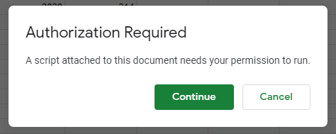

Click Continue. Google will ask you to choose an account. Select your currently logged in account

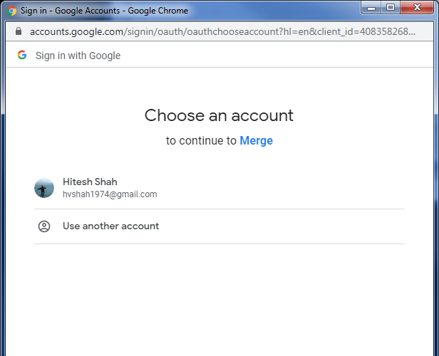

You'll get a warning message indicating that the script is not verified. Since it's being installed _by you_ on your account, and you have access to the source code, you should feel comfortable with proceeding. Select the `Advanced` link in the lower left corner of the window.

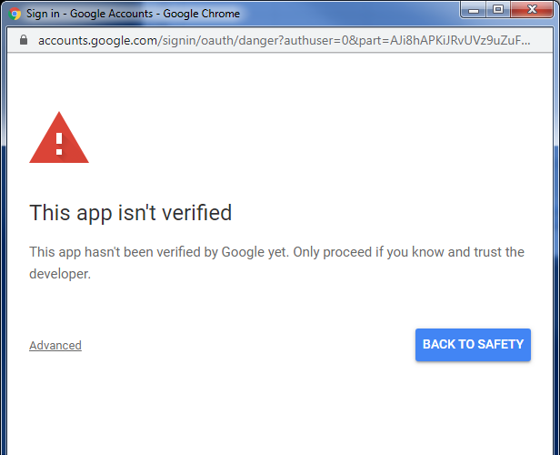

Read the cautionary verbiage at the bottom of the screen and select the `Go to Merge` link at the bottom

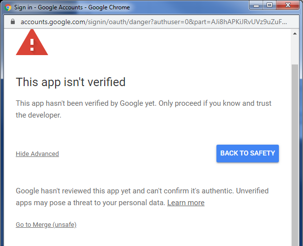

You'll get a screen presenting the permissions that the script is requesting on your account. Confirm that your account is at the top of the screen, and click the `Allow` button.

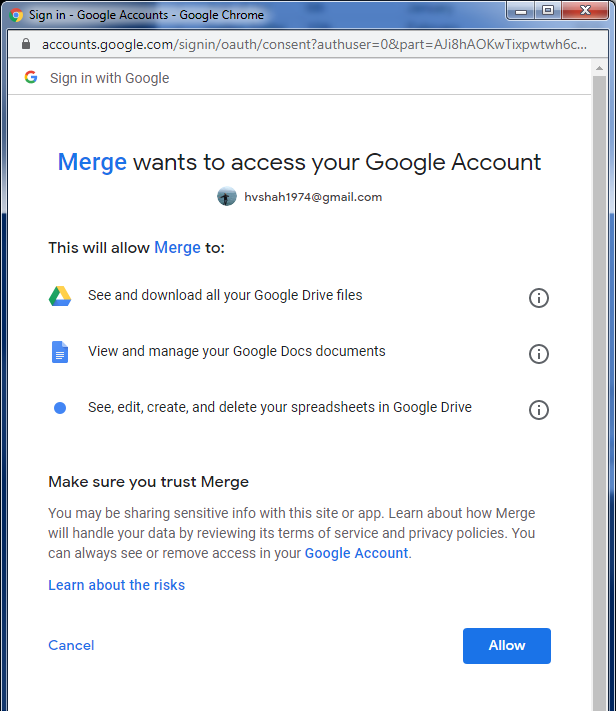

Once you allow permissions, the script should execute *for the tab that you're currently on* in the spreadsheet, using the same name to look up the template document. The script will display a message when it's complete, with the name of the output file it generated as a result of the mail merge. The output file name will be the same as the template, with the word `output` and a date/timestamp value appended. For example, `Happy Birthday Form Letter-output-20191231-220602-762` which represents the execution of the script against the template `Happy Birthday Form Letter` at the time of writing - on 2019/12/31 (New Year's Eve) at 22:06:02.762 UTC (2.762 seconds after 5:02pm Eastern Daylight Time)

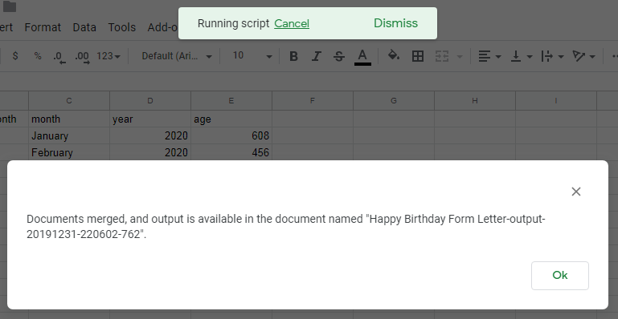

When you navigate back to Drive, you should see the new file

When you open the file, you should see the results of the mail merge. In my example, I see an 8-page document, with one birthday note to each recipient on their birthday

Done with execution

### Mail merge with labels (or label-like things)
Form letters are useful, but I've needed "label-like" things far more often. This utility does "label-like" also. I intentionally call it "label-like" because it doesn't have any built-in templates for off-the-shelf labels from the standard manufacturers. In fact, I've only ever used it for generating a sheet of math problems for my kid, using the following steps.

#### Create the template document
In your Google Drive main page, create a new Google Doc (`+ New` :arrow_right: `Google Docs` :arrow_right: `Blank document`)

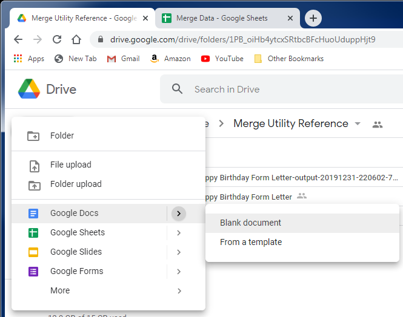

Enter the body of your template, using `<<` and `>>` to indicate variables that should be replaced as part of your mailmerge.

*NOTE*: For "label-like" mail merges, the document _can only contain_ a single table with one row. This is super-important, otherwise the merge utility won't work.

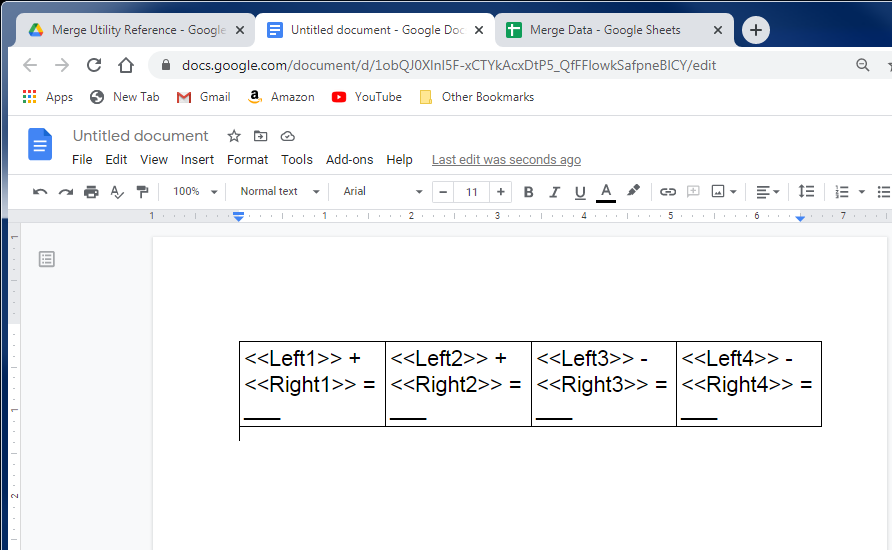

Give your document a name.

*NOTE*: The name must _not_ match any other document in any folder within your Drive. This is super-important, otherwise the merge utility won't work.

Also, make sure you remember the name because it'll be used later.

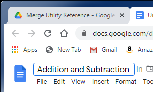

Done with the template

#### Create the merge data
You can create a new merge data Google Sheet *or* create a new sheet in the existing Google Sheet that has the Merge utility installed. The below steps are for a new tab. If you choose to create a new Sheet, follow the first couple of steps of the "Create the merge data" section above, and repeat all of the steps in the "Add the utility script to the merge data sheet" section for the new Sheet.

In the existing merge data sheet, click the giant + icon in the lower left corner to add a new sheet
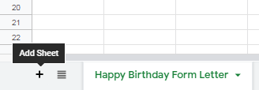

In the first row, enter each of the names of the variables you used in your template doc

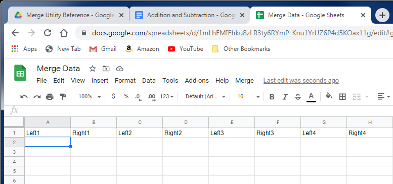

For each copy of the letter you want to create, enter a new row in the sheet

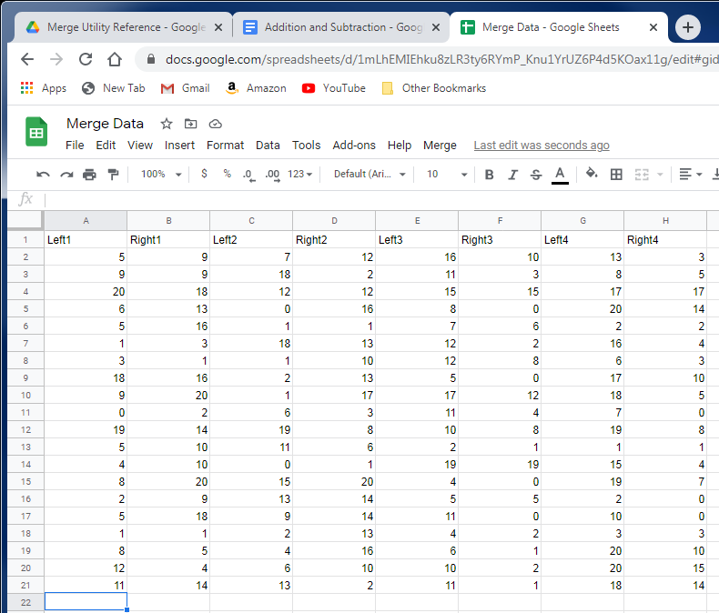

Name the tab to match the template document name exactly.

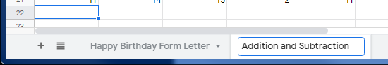

Done with the merge data

#### To execute the script
If you chose to create a new Google Sheet for your new merge data, follow the steps in the "To execute the script" section above.

Make sure you're on the "label-like" sheet in the merge data Google Sheet. Selecting the `Merge` menu and the 'Merge' menu option will execute the script. The script should execute *for the tab that you're currently on* in the spreadsheet, using the same name to look up the template document. The script will display a message when it's complete, with the name of the output file it generated as a result of the mail merge. The output file name will be the same as the template, with the word `output` and a date/timestamp value appended. For example, `Addition and Subtraction-output-20201213-032949-545` which represents the execution of the script against the template `Addition and Subtraction` at the time of writing - on 2020/12/13 at 03:29:49.545 UTC (49.545 seconds after 10:29pm Eastern Standard Time on December 12, 2020)

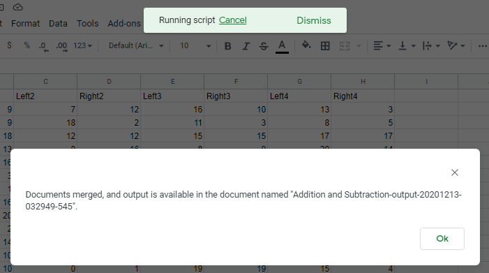

When you navigate back to Drive, you should see the new file. When you open the file, you should see the results of the mail merge.

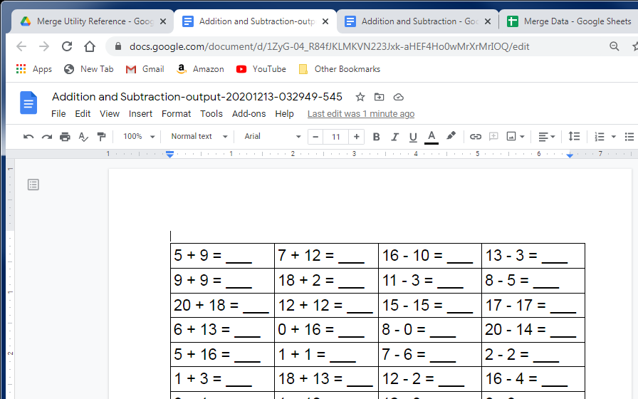

Done with "label-like" execution.

*NOTE* I've been using the phrase "label-like" because this program is small and simple. It contains no standard templates for the standard label manufacturers' products. If you want true "label" functionality, you can look up the dimensions of the labels online (or on the box) for the specific product you're trying to print.

### Sample
The samples I generated while putting together this README can be found in a public folder on my Google Drive: https://drive.google.com/drive/u/0/folders/1PB_oiHb4ytcxSRtbcBFcHuoUduppHjt9

Please don't hestitate to reach out with questions / concerns, or if you'd like to see (or build) additional features.