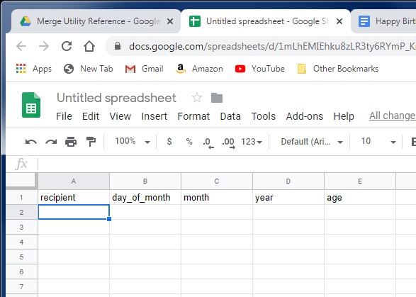
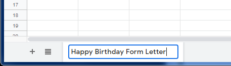
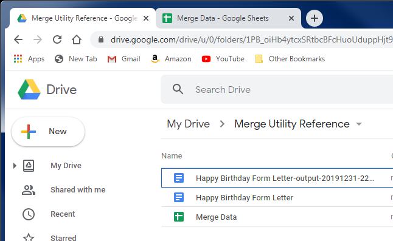
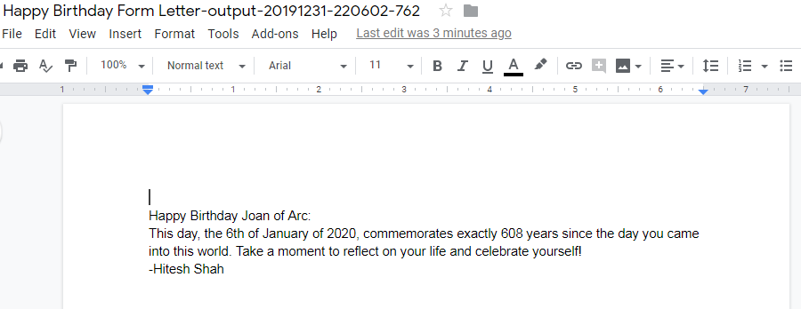

# mergeutility
## Description
Utility that provides Mail Merge functionality to Google Sheets and Docs

## Setup
To set up this utility for a mail merge document, you'll need to:
* Create the template document
* Create the merge data
* Add the utility script to the merge data sheet

Once those steps are done, you can execute the utility as many times as you need. To set up another mail merge document, repeat the above three steps.

### Create the template document
Open Google Drive

In the first row, enter each of the names of the variables you used in your template doc

For each copy of the letter you want to create, enter a new row in the sheet

Give your spreadsheet a name. Any name will do.

Name the tab to match the template document name exactly.

Done with the merge data

### Add the utility script to the merge data sheet
On the merge data spreadsheet, open the `Tools` menu and select the `Script Editor` option

The script editor should open a file called `Code.gs` in a new tab (or window) of your browser, with an empty function called `myFunction`

Replace all the contents of the script editor with contents of the utility script (all the code) from X:

Select `File` :arrow_right: `Save` and enter a project name

Done with setup

### To execute the script
The first time you want to execute the script after setting it up, you'll need to close all the documents you created (template doc and merge data spreadsheet).
Open the merge data spreadsheet. If this is the first time opening the spreadsheet after setting up the utility, it'll take some time to open. Once it's open, you should see a new menu option for `Merge`, after the `Help` menu

Opening the Merge menu should give you one option called `Merge`

Selecting the `Merge` menu option will execute the script. If this is your first time running the script for this spreadsheet, you will get a popup for Authorization Required.

Click Continue. Google will ask you to choose an account. Select your currently logged in account

You'll get a warning message indicating that the script is not verified. Since it's being installed _by you_ on your account, and you have access to the source code, you should feel comfortable with proceeding. Select the `Advanced` link in the lower left corner of the window.

Read the cautionary verbiage at the bottom of the screen and select the `Go to Merge` link at the bottom

You'll get a screen presenting the permissions that the script is requesting on your account. Confirm that your account is at the top of the screen, and click the `Allow` button.

Once you allow permissions, the script should execute *for the tab that you're currently on* in the spreadsheet, using the same name to look up the template document. The script will display a message when it's complete, with the name of the output file it generated as a result of the mail merge. The output file name will be the same as the template, with the word `output` and a date/timestamp value appended. For example, `Happy Birthday Form Letter-output-20191231-220602-762` which represents the execution of the script against the template `Happy Birthday Form Letter` at the time of writing - on 2019/12/31 (New Year's Eve) at 22:06:02.762 UTC (2.762 seconds after 5:02pm Eastern Daylight Time)

When you navigate back to Drive, you should see the new file

When you open the file, you should see the results of the mail merge. In my example, I see an 8-page document, with one birthday note to each recipient on their birthday

